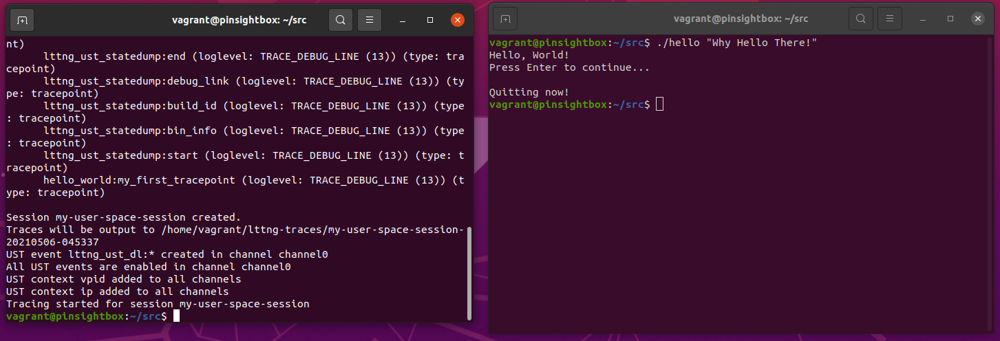
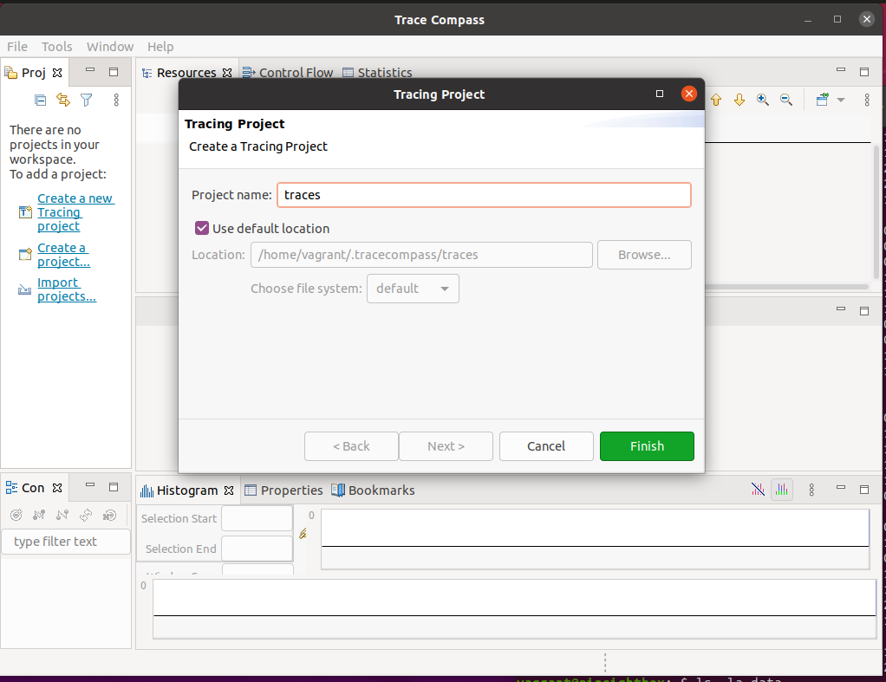
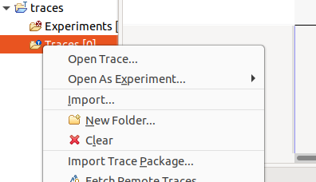
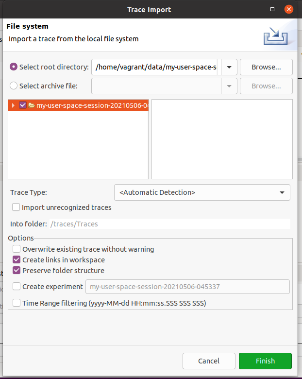
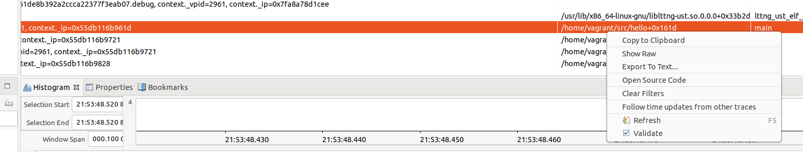
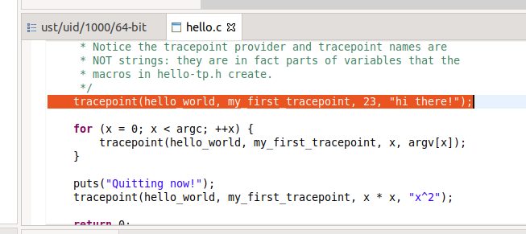

This example shows how to enable Trace Compass to show the action of opening a source code based on the binary information in the trace record. 

To show the action of opening a source code using trace compass, a trace needs to be generated on the local machine where tracecompass will be utilized. This allows the binary source location to detect the source file and source function from the trace. To utilize a VM machine with tracecompass and lttng installed pinsight has a [VirtualBox with Vagrant configured](https://drive.google.com/drive/folders/1Nnp1AB3kDKpVU7ZLRTvs0dxCtaK1KTan?usp=sharing)

# Configuring the environment

Before running lttng to generate traces, ensure that the necessary packages are installed 

```bash
sudo apt -y --force-yes install lttng-tools
sudo apt -y --force-yes install lttng-modules-dkms
sudo apt -y --force-yes install liblttng-ust-dev
sudo apt -y --force-yes install liblttng-ust-agent-java
sudo apt -y --force-yes install python3-lttngust
```

# Building the scripts

To build the lttng example scripts, run the `src/trace-build.sh` command to generate the `hello` and `app` runnable files. These runnable files are to be run alongside the tracing command, `src/trace-start.sh`

The `hello` example was pulled from the LTTng ["Trace a user application" example](http://web.archive.org/web/20210311124027/https://lttng.org/docs/v2.12/#doc-tracing-your-own-user-application). 

# Collecting a Trace

To collect the traces start up one of the example runnable files in a seperate terminal and run the `src/trace-start.sh` command, shown in the image below. Once the `trace-start` command finishes, you can press enter in the runnable terminal, allowing the traces to save and the runnable to finish. Once the runnable is finished, call the `src/trace-stop.sh` command in the original terminal, this stops the tracing from running. The traces should be stored in the `~/data/my-user-space-session-{time}` directory, where `{time}` is the current time of the system.

The example below ran the `hello` example as:

```bash
$ ./hello "Why Hello There!"
```

It's important to start the runnable file first



# Viewing the Open Source Code 

Open your Trace Compass program on your machine. In the aformentioned VM Machine, Trace Compass is installed in the `~/trace-compass` directory. Create a new tracing project, shown below.



Import the traces you generated earlier by right clicking on your project and selecting the directory where the traces are stored, e.g. `~/data/my-user-space-session-{time}`. Note, sometimes the `~/data` directory and its subdirectories may be created by the `root` user, simply run `chmod -R 755 ~/data/my-user-space-session-{time}` to give read access to the traces.





After the traces have been imported, drill down to "Traces > ust > uid > 1000 > 64-bit" and double click on `64-bit` to open the traces collected earlier. Scroll all the way down until you see the "Binary Location", "Function Location", and "Source Location" columns filled in with information about the source. Right click on one of the columns and the "Open Source Code" option should be visible, shown below. Clicking on the "Open Source Code" action should send you directly to the source code.



