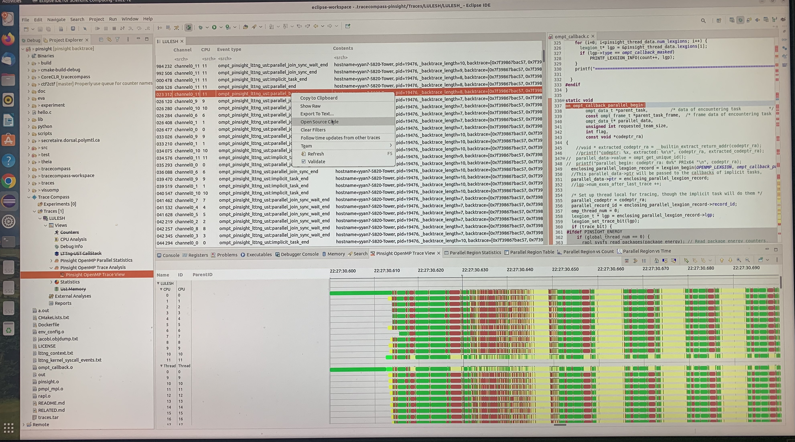

## Source code lookup from the trace record generated by LTTng for PInsight

This feature enables users to conveniently locate the source code line where a trace is generated. LTTng and Tracecompass have this feature as [Souce Code Lookup](https://archive.eclipse.org/tracecompass/doc/stable/org.eclipse.tracecompass.doc.user/LTTng-UST-Analyses.html#Source_Lookup_.28for_LTTng-UST_2.8.2B.29)
for LTTng-UST events. With this feature, when the required events and context are enabled (check the above link), the trace record table viewer will be 
automatically populated with columns (event aspects in the implementation) such as Binary Location, Function Location and Source Location. 
However, as for PInsight, the LTTng-UST events are triggered by the PInsight library calls which are runtime callbacks of OMPT/PMPI/CUPTI for OpenMP/MPI/CUDA. Thus the LTTng/Tracecompass orginal
source code lookup only allows us to point to the PInsight library source code location, not the source code location of the actual application that PInsight is tracing. Then the goal for this 
feature is to enable application source code lookup (including backtrace source code lookup) of the application source code. 

### To experiment and understand LTTng/Tracecompass source code lookup
The events and context that are needed to enable [Souce Code Lookup](https://archive.eclipse.org/tracecompass/doc/stable/org.eclipse.tracecompass.doc.user/LTTng-UST-Analyses.html#Source_Lookup_.28for_LTTng-UST_2.8.2B.29) is already
included in the scripts/trace.sh file, thus if you follow the top-level README.md file to build and trace an application (Jacobi or LULESH for example), you should be
able to see this feature, see below screenshot of the LULESH traces and source code lookup enabled. In the screenshot, the "Open Source Code" menu item will show up if the 
Source Locatation aspect is found for the trace record.  

As mentioned in the  [Souce Code Lookup](https://archive.eclipse.org/tracecompass/doc/stable/org.eclipse.tracecompass.doc.user/LTTng-UST-Analyses.html#Source_Lookup_.28for_LTTng-UST_2.8.2B.29), it uses addr2line and nm utility to find out the binary/function/source location based on the vip and other information that are included in each trace record. 

### To develop PInsight source code lookup for a PInsight-traced application
PInsight stores the codeptr provided by OMPT/PMPI/CUPTR in the trace record, such as ```parallel_codeptr``` for OpenMP. So we can develop a tracecompass plugin (see the [README.md](../README.md) file for details and doc on how to do that) to replicate the LTTng/Tracecompass sources code lookup for application source code lookup. 

A first-step proof-of-concept experiment is to hack Tracecompass source code lookup feature, i.e. replacing the vip address of each trace record with the address queryed from parallel_codeptr. 

### To enable backtrace source code lookup for a PInsight-traced application
The backtrace branch supports the implementation of adding backtrace information for each trace record, with backtrace information, we can develop 
similar feature of source code lookup for each function call in the backtrace, similar to [GDB Tracepoint Analysis](https://archive.eclipse.org/tracecompass/doc/stable/org.eclipse.tracecompass.gdbtrace.doc.user/User-Guide.html)

