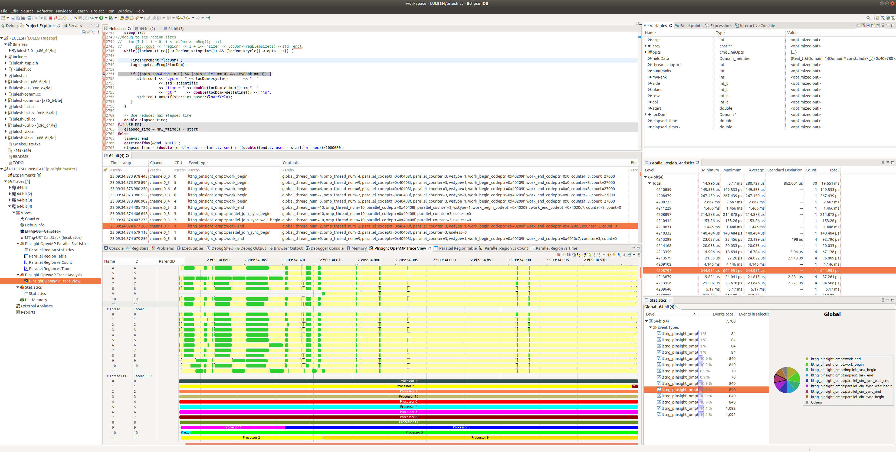

## Debugging for performance

### Goals: when a program stops at the breakpoints, the debugger will analyze traces collected and show the tracecompass view. 
Essentially it is the integration of LTTng + tracecompass + debugger (editor)
- [ ] Need to make sure lttng is able to collect all traces and dump them for analysis
- [ ] Need to improve the debugger to bring the tracecompass view to the PTP perspective. 
- [ ] PTP can be used for remote debugging, but we can start with local debugging with standard CDT program and then migrate to PTP. 

### Configuring LULESH and Eclipse debuger to connect a running LULESH process
1. LULESH needs to be build with clang, modify Makefile to have 'MPICXX = OMPI_CC=clang OMPI_CXX=clang++ mpicxx -DUSE_MPI=1'
2. [ptrace needs to be disabled in kernel](https://stackoverflow.com/questions/19215177/how-to-solve-ptrace-operation-not-permitted-when-trying-to-attach-gdb-to-a-pro) so you can attach a Eclipse debugger with a running LULESH process that is launched by the trace.sh script. If we need to launch the application from Eclipse in debugging mode directly, we need to configure in Eclipse to let lttng to create trace session, setting up trace event, etc and then launch the application. Or the lttng trace session can be started outside of the Eclipse.
3. In Eclipse, after all the required plugins are installed (tracecompass, lttng, CDT, Debuging) etc. We can show the tracecompass view, debugger view, code editor in a single perspective, thanks to the flexible plugin architecture and interface design of Eclipse. See below screenshot. In the current Eclipse setting, two projects need to be created, one for source code editing/debugging, and one for tracecompass. There are not connection between the two projects. 

### To enable performance debugging Eclipse/Tracecompass/LTTng
1. In a debug session, i.e. if we want to trace and anlyze the traces recorded between two debugging breakpoints, traces needs to be recorded as fresh new one upon starting the beginning checkpoint, and then recorded at the ending checkpoint, then the traces can be anlyzed for just the execution between the two breakpoints. This is realized using [LTTng rotate](https://lttng.org/docs/#doc-session-rotation). `lttng rotate` needs to be called upon entering the beginning breakpoint and after the ending breakpoint. The traces recorded after the last rotate is the traces needed for the code executed between the two breakpoints. 
2. [LTTng snapshot](https://lttng.org/docs/#doc-taking-a-snapshot) is another feature of LTTng that allows to record traces from the beginning till the point the snapshot is taken. Same records can be recorded more than once if multiple snapshots are taken. Thus rotate is what we need. 

### Related work
1. [Implementing Debug behavior in the Eclipse IDE - Tutorial](https://www.vogella.com/tutorials/EclipseDebugFramework/article.html)
2. [Eclipse Event and Communication](https://www.vogella.com/tutorials/Eclipse4EventSystem/article.html). [Event and Handler between views](https://tranhoangminh.wordpress.com/2013/07/29/1963/) and [Another one](https://tomsondev.bestsolution.at/2011/01/03/enhanced-rcp-how-views-can-communicate/). Check [Eclipse Communication Framework Project](https://wiki.eclipse.org/Eclipse_Communication_Framework_Project)
3. [Eclipse Selection service](https://www.eclipse.org/articles/Article-WorkbenchSelections/article.html), and other [Eclipse Platform Service](https://www.vogella.com/tutorials/Eclipse4Services/article.html)
