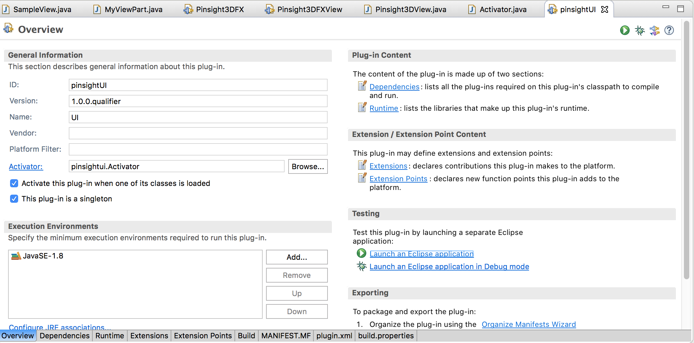
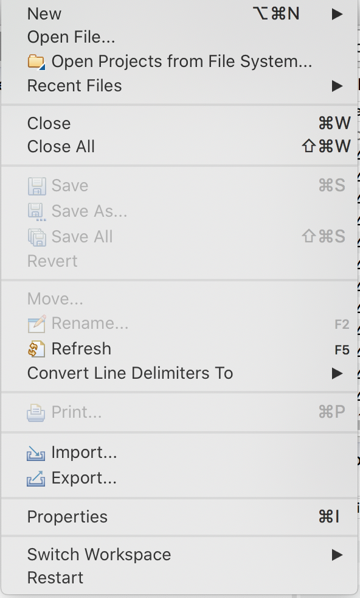
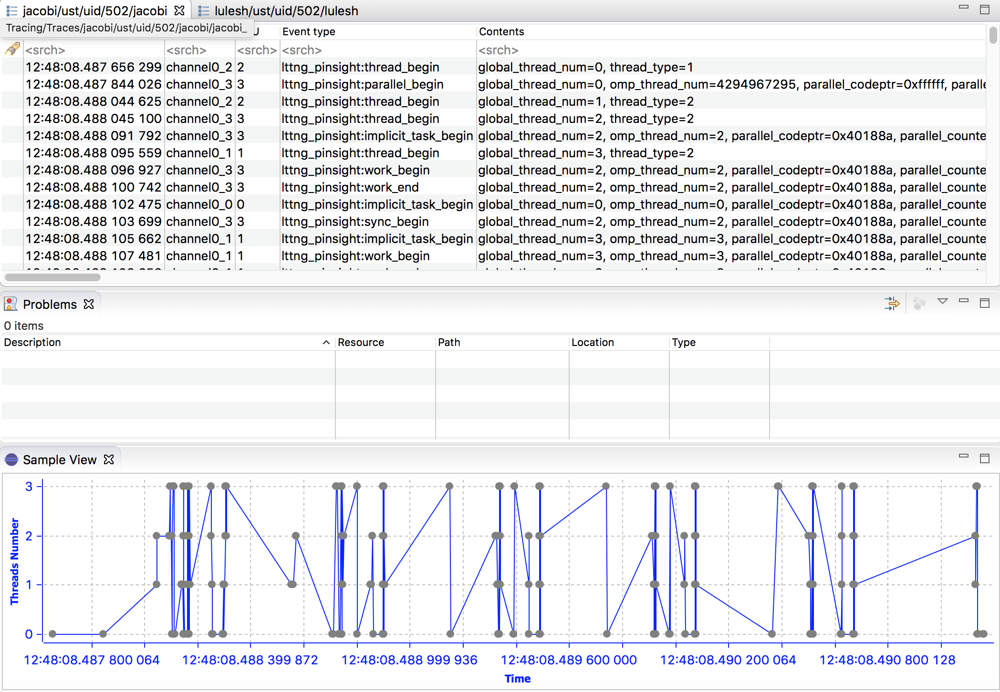

## Instructions for starting developing Eclipse/Tracecompass-based visualization for PInsight
This folder contains instructions and sample files/traces to help one start developing Eclipse/Tracecompass-based visualization

### Set up tracecompass and visualize the sample data using XML data-driven view. 
1. Download and install tracecompass (https://www.eclipse.org/tracecompass/ ) . 
2. Read [tracecompass user guide](https://archive.eclipse.org/tracecompass/doc/stable/org.eclipse.tracecompass.doc.user/User-Guide.html) to get familiar with the UI interface and their functionality
3. Import the xml file [pinsight-analysis.xml](pinsight-analysis.xml) to setup pinsight data-driven analysis and visualization. The XML file is developed using a [data driven analysis solution in tracecompass](https://archive.eclipse.org/tracecompass/doc/stable/org.eclipse.tracecompass.doc.user/Data-driven-analysis.html#Data_driven_analysis). 
4. Open [the sample trace package](traces.tar), unpack it and open it with tracecompass to visualize. You will need to go down to the deep of the folder and open a metadata file.

   
### for mac:
1. Download the Eclipse IDE: https://www.eclipse.org/downloads/download.php?file=/oomph/epp/2023-06/R/eclipse-inst-jre-mac64.dmg
2. Read Trace compass user guide (https://archive.eclipse.org/tracecompass/doc/stable/org.eclipse.tracecompass.doc.user/User-Guide.html) to get familiar with the UI interface and their functionality
3. open eclipse installer and open the "Eclipse IDE for Java Developers"
4. After installing> open Eclipse>Help>Install New Software. Use this link for the following repo for tracecompass: http://download.eclipse.org/tracecompass/releases/9.0.0/repository/
   

5. After the installation of tracecompass plugin, Eclipse will restart
6. After restart, create a new trace project
7. File>New>Project

8. Tracing>Tracing project
  
  
9. Read [tracecompass user guide](https://archive.eclipse.org/tracecompass/doc/stable/org.eclipse.tracecompass.doc.user/User-Guide.html) to get familiar with the UI interface and their functionality.
10. Import the xml file [pinsight-analysis.xml](pinsight-analysis.xml) to setup pinsight data-driven analysis and visualization. The XML file is developed using a [data driven analysis solution in tracecompass](https://archive.eclipse.org/tracecompass/doc/stable/org.eclipse.tracecompass.doc.user/Data-driven-analysis.html#Data_driven_analysis).
11. Open [the sample trace package](traces.tar), unpack it and open it with tracecompass to visualize. You will need to go down to the deep of the folder and open a metadata file. Download this file. Unzip the file and import it to the "traces" folder in eclipse. It should look like this after importing the traces. 


12. You should see the following after you click the PInsight OpenMP Trace Review button deep in the Traces. You will be able to see the data like this.
    


   


### Create a plugin in Eclipse 
1. Check [the Tracecompass tutorial for creating a plugin](https://archive.eclipse.org/tracecompass/doc/org.eclipse.tracecompass.doc.dev/View-Tutorial.html#View_Tutorial). The tutorial is part of [the Tracecompass developer guide](https://archive.eclipse.org/tracecompass/doc/org.eclipse.tracecompass.doc.dev/Developer-Guide.html) that also includes other features for analysis and visualization 
2. With the tutorial, have the example working to the step of creating an empty view, but not using the data provided by the example traces in the tutorial since we will need to populate the view using the provided sample trace files. The code used in the the tutorial example are outdated and we will update as we progress.
3. In your plugin view, modify the code to visualize the parallel region of the traces by analyzing the lttng_pinsight:parallel_begin and lttng_pinsight:parallel_end events for the trace you have. You can put in the bar chart for the visualization: X-axis is the parallel_codeptr, y-axis is the accumulated execution time of the parallel region. 

For example in the following code, there are two parallel regions, executed 10 and 20 times. Your traces will have a pair parallel_begin and parallle_end events for each execution of a parallel region. Thus in your analysis code, you will iterate all the traces and search the event pair, find the difference of the time-stamp of the two events, which is the execution time for each execution, and the accumulated all the execution time of the same parallel region. a parallel region is identified by parallel_codeptr event filed.

```
main() {
  for (i=0; i<10; i++) {
      //sequential region
      #pragma omp parallel num_threads(4) //parallel region 1, executed 10 times, parallel_begin event
      {
           printf("hello world, parallel region #1\n"); 
      }   //parallel_end event
     //sequential region 
   }

  for (i=0; i<20; i++) {
       //sequential region
      #pragma omp parallel num_threads(6) //parallel region 2, executed 20 times
      {
                       printf("hello world, parallel region #2\n"); 
      }
      //sequential region
  }

}
```

### Steps for launching and debugging a plugin under Eclipse (provided by Yaying), need more details. 
1. Launch Eclipse IDE and open plugin

2. Import trace data

3. Add plugin



 
