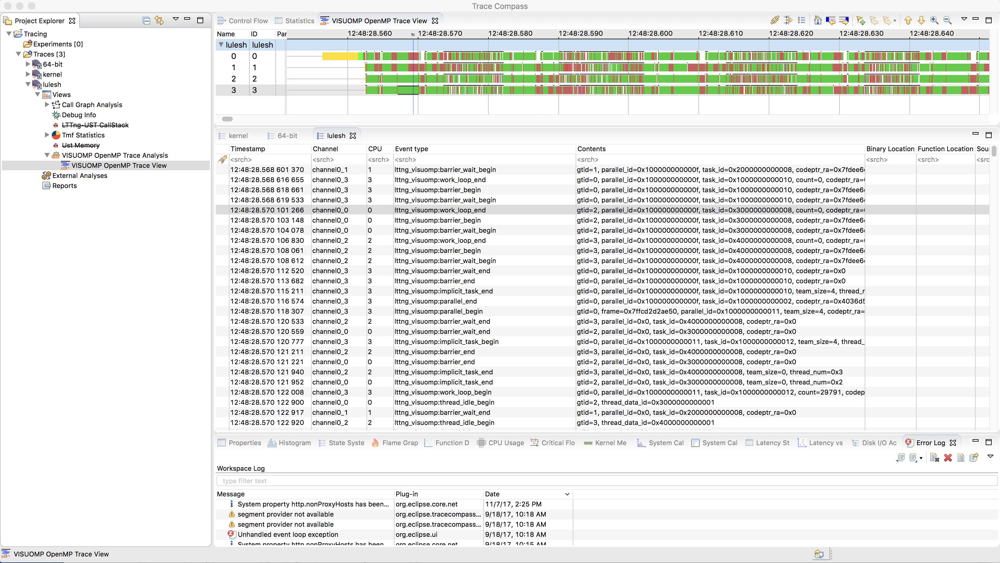

# OpenMP OMPT Event Tracing and Visualization

 * LTTng tracing framework (http://lttng.org/) for tracing OpenMP runtime using `lttng-ust` library.
 * Eclipse-based tracecompass GUI (http://tracecompass.org/) for visualize the tracing results. https://github.com/lttng/lttng-scope and https://github.com/lttng/lttng-analyses, http://diamon.org/babeltrace/
 * It requires to use data-driven analysis of tracecompass to visualize the OpenMP tracing data (http://help.eclipse.org/).
 * Tracecompass developer and user guide (https://wiki.eclipse.org/Trace_Compass)
 * Research project from Polytechnique Montreal: http://hsdm.dorsal.polymtl.ca/
 * Geneviève Bastien's tracing blog: http://versatic.net/
 * https://github.com/efficios that has https://github.com/efficios/babeltrace and other interesting code repo
 * LTTng Scope is a trace viewer and analyzer for CTF traces, with a focus on LTTng kernel and user space traces: https://github.com/lttng/lttng-scope

# Update to the latest OMPT implemetation in LLVM
 * Use https://github.com/llvm-mirror/openmp/blob/master/runtime/test/ompt/callback.h as reference to make sure the use of OMPT is updated to the latest OMPT support in LLVM OpenMP
 
 ### Tracecompass development
 Tracecompass is an Eclipse plugin and framework. Follow the steps from the wiki page for the development:
 * Set up Eclipse development environment
 * Clone tracecompass repo (https://git.eclipse.org/c/tracecompass/org.eclipse.tracecompass.git/about/)
 * Study the developer guide and browse source code for the development
 * Eclipse plugin tutorial (http://www.vogella.com/tutorials/EclipsePlugin/article.html)

 ### Screenshot
 #### Lulesh tracing and visualization with Tracecompass
 . The picture was created in Tracecompass using [Data driven analysis](
 http://archive.eclipse.org/tracecompass/doc/stable/org.eclipse.tracecompass.doc.user/Data-driven-analysis.html#Data_driven_analysis). You need to load visuomp-analysis.xml description file (which describe how to visulize the trace data) in Tracecompass and select the review for that.

### Analyses considered
 1. Overhead analysis.
 1. Load balance analysis.
 1. Offline analysis for configuring power usage and frequency (perhaps binary-based?).

### Related work
 1. Graingraph for OpenMP (https://dl.acm.org/citation.cfm?id=2851156)
 1. TAU instrument tool (http://www.cs.uoregon.edu/research/tau/home.php)
 1. HPCToolkit/Perf (sampling) (http://hpctoolkit.org/)
 1. https://www.vi-hps.org/projects/score-p/
